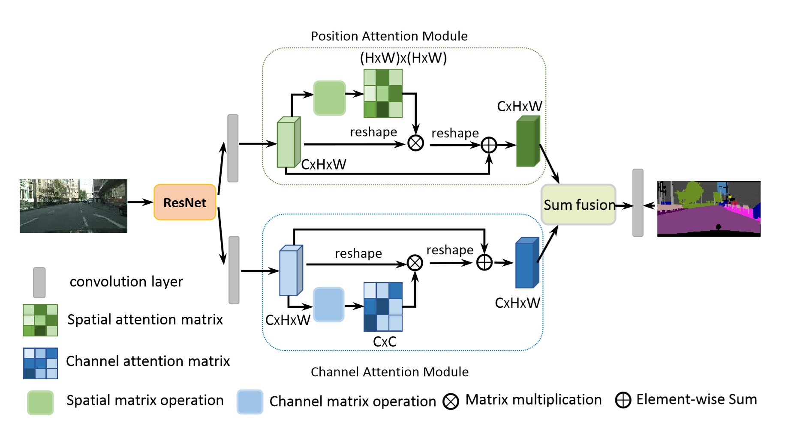
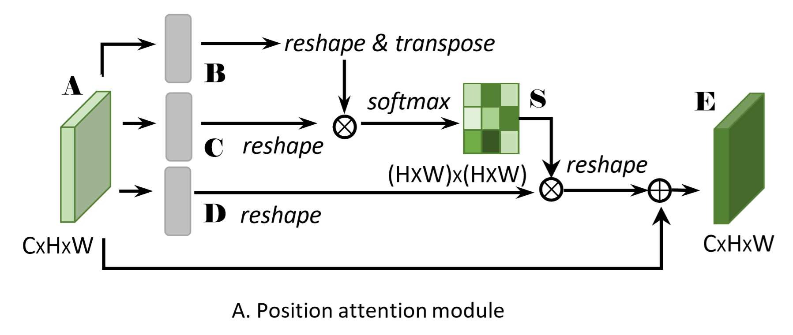
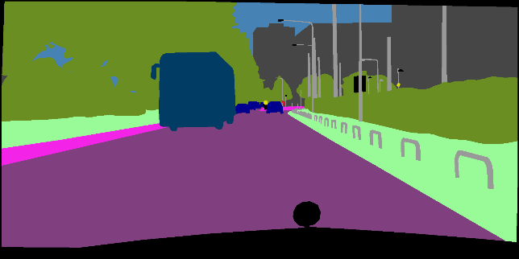
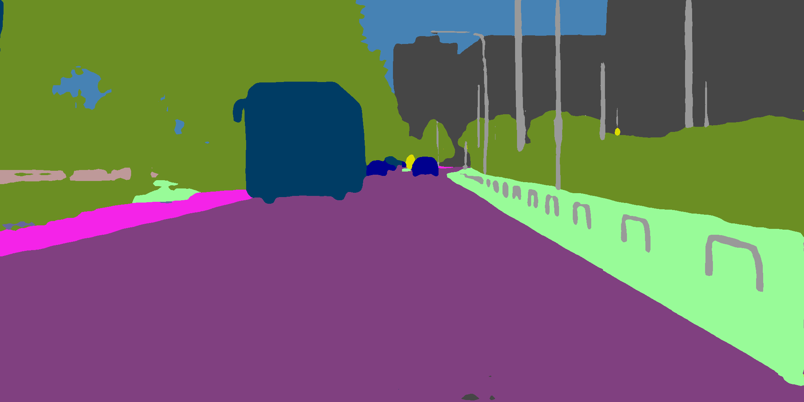

# [Dual Attention Network for Scene Segmentation (CVPR2019)](https://arxiv.org/pdf/1809.02983.pdf)

本项目是[DANet](https://arxiv.org/pdf/1809.02983.pdf)的 PaddlePaddle 实现， 包含模型训练，验证等内容。

## 模型简介

骨干网络使用ResNet，为更好地进行语义分割任务，作者对ResNet做出以下改动：

    1、将最后两个layer的downsampling取消，使得特征图是原图的1/8，保持较高空间分辨率。
    2、最后两个layer采用空洞卷积扩大感受野。
然后接上两个并行的注意力模块（位置注意力和通道注意力），最终将两个模块的结果进行elementwise操作，之后再接一层卷积输出分割图。

### 位置注意力



A是骨干网络ResNet输出经过一层卷积生成的特征图，维度为CHW；
A经过3个卷积操作输出维度均为CHW的B、C、D。将B、C、D都reshape到CN（N = H*W）；
然后将B reshape后的结果转置与C相乘，得到N * N的矩阵， 对于矩阵的每一个点进行softmax；
然后将D与softmax后的结果相乘并reshape到CHW，再与A进行elementwise。

### 通道注意力


A是骨干网络ResNet输出经过一层卷积生成的特征图，维度为CHW；
A经过3个reshape操作输出维度均为CN（N = H*W）的B、C、D；
然后将B转置与C相乘，得到C * C的矩阵，对于矩阵的每一个点进行softmax；
然后将D与softmax后的结果相乘并reshape到CHW，再与A进行elementwise。


## 数据准备

公开数据集：Cityscapes

训练集2975张，验证集500张，测试集1525张，图片分辨率都是1024*2048。

数据集来源：AIstudio数据集页面上[下载](https://aistudio.baidu.com/aistudio/datasetDetail/11503)，放到dataset文件夹下，其目录结构如下：
```text
dataset
├── cityscapes            # Cityscapes数据集
    ├── gtFine            # 精细化标注的label
    ├── leftImg8bit       # 训练，验证，测试图片      
    ├── trainLabels.txt   # 训练图片路径
    ├── valLabels.txt     # 验证图片路径            
        ...               ...
```
## 训练说明

#### 数据增强策略
    1、随机尺度缩放：尺度范围0.75到2.0
    2、随机左右翻转：发生概率0.5
    3、同比例缩放：缩放的大小由选项1决定。
    4、随机裁剪：
    5、高斯模糊：发生概率0.3（可选）
    6、颜色抖动，对比度，锐度，亮度; 发生概率0.3（可选）
###### 默认1、2、3、4都开启，5、6关闭

#### 学习率调节策略
    1、使用热身策略，学习率由0递增到base_lr，热身轮数（epoch）是5
    2、在热身策略之后使用学习率衰减策略（poly），学习率由base_lr递减到0

#### 优化器选择
	Momentum: 动量0.9，正则化系数1e-4
	
#### 加载预训练模型
	设置 --load_pretrained_model True （默认为True）
	预训练文件：
	    checkpoint/DANet50_pretrained_model_paddle1.6.pdparams
        checkpoint/DANet101_pretrained_model_paddle1.6.pdparams
		
#### 不加载预训练模型
	从0开始训练，需要设置 --load_pretrained_model False

#### 加载训练好的模型
	设置 --load_better_model True （默认为False）
	训练好的文件：
		checkpoint/DANet101_better_model_paddle1.6.pdparams
##### 【注】
    训练时paddle版本是1.5.2，代码已转为1.6版本（兼容1.6版本），预训练参数、训练好的参数来自1.5.2版本

#### 配置模型文件路径[预训练参数、最优模型参数下载](https://pan.baidu.com/s/1C7pe1U4SPtDqVADaMD1Oiw)

其目录结构如下：
```text
checkpoint
    ├── DANet50_pretrained_model_paddle1.6.pdparams       # DANet50预训练模型，适合1.6.0版本
    ├── DANet101_pretrained_model_paddle1.6.pdparams      # DANet101预训练模型，适合1.6.0版本
    ├── DANet101_better_model_paddle1.6.pdparams          # DANet101训练最优模型，适合1.6.0版本
    ├── DANet101_better_model_paddle1.5.2                 # DANet101训练最优模型，只适合1.5.2版本
    
```

## 模型训练
```sh
# open garbage collection to save memory
export FLAGS_eager_delete_tensor_gb=0.0
# setting visible devices for prediction
export CUDA_VISIBLE_DEVICES=0,1,2,3


python train_executor.py --backbone resnet101 --batch_size 2 --lr 0.003 --lr_scheduler ploy --epoch_num 350 --crop_size 768 --base_size 1024 --warm_up True --cuda True --use_data_parallel True --dilated True --multi_grid True --multi_dilation [4, 8, 16] --scale True --load_pretrained_model True --load_better_model False
或者
python train_dygraph.py --backbone resnet101 --batch_size 2 --lr 0.003 --lr_scheduler ploy --epoch_num 350 --crop_size 768 --base_size 1024 --warm_up True --cuda True --use_data_parallel True --dilated True --multi_grid True --multi_dilation [4, 8, 16] --scale True --load_pretrained_model True --load_better_model False

```
#### 【注】
##### train_executor.py使用executor方式训练（适合paddle1.5.2），train_dygraph.py使用动态图方式训练（适合paddle1.6.0），两种方式都可以
##### 在训练阶段，验证的结果不是真实的，需要使用eval.py来获得验证的最终结果。
 
 ## 模型验证
```sh
# open garbage collection to save memory
export FLAGS_eager_delete_tensor_gb=0.0
# setting visible devices for prediction
export CUDA_VISIBLE_DEVICES=0

python eval.py --backbone resnet101 --load_better_model True --batch_size 1 --crop_size 1024 --base_size 2048 --cuda True --multi_scales True --flip True --dilated True --multi_grid True --multi_dilation [4, 8, 16]
```
#### 【注】
##### 使用多尺度验证需要耗费更长的时间(大概16小时)

## 验证结果
评测指标：mean IOU(平均交并比)


| 模型 | 单尺度 | 多尺度 |
| :---:|:---:| :---:|
|DANet101|0.8043836|0.8138021

##### 具体数值
| 模型 | cls1 | cls2 | cls3 | cls4 | cls5 | cls6 | cls7 | cls8 | cls9 | cls10 | cls11 | cls12 | cls13 | cls14 | cls15 | cls16 |cls17 | cls18 | cls19 |
| :---:|:---: | :---:| :---:|:---: | :---:| :---:|:---: | :---:| :---:|:---:  |:---: |:---:  |:---:  | :---: | :---: |:---:  | :---:| :---: |:---:  | 
|DANet101-SS|0.98212|0.85372|0.92799|0.59976|0.63318|0.65819|0.72023|0.80000|0.92605|0.65788|0.94841|0.83377|0.65206|0.95566|0.87148|0.91233|0.84352|0.71948|0.78737|
|DANet101-MS|0.98047|0.84637|0.93084|0.62699|0.64839|0.67769|0.73650|0.81343|0.92942|0.67010|0.95127|0.84466|0.66635|0.95749|0.87755|0.92370|0.85344|0.73007|0.79742|

## 输出结果可视化

###### 输入图片

###### 图片label

###### DANet101模型输出

